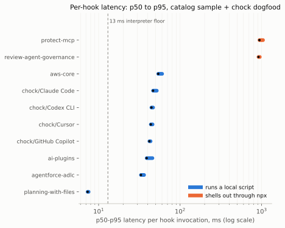
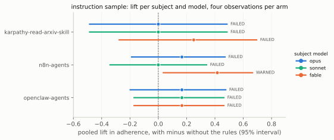

<div align="center">

<p></p>

</div>

# Teach your AI agent what not to do.

Open-source guardrails for AI coding agents: rules the agent reads, checks that run as it writes, and gates at commit and in CI. context-report is the evidence arm: an open, signed report of whether an agent plugin, hook, skill or `AGENTS.md` actually works.

[chock](https://github.com/open-coder-ai/chock) · [chock-catalog](https://github.com/open-coder-ai/chock-catalog) · chock.sh (launching soon)

[](https://github.com/open-coder-ai/context-report/actions/workflows/ci.yml) [](https://pypi.org/project/context-report/) [](https://www.python.org) [](LICENSE) [](https://scorecard.dev/viewer/?uri=github.com/open-coder-ai/context-report) [](CONTRIBUTING.md)

`context-report` is an open, signed report format for one question: **does this agent context artifact actually work?** A plugin, hook, skill, `AGENTS.md` or MCP server gets one row per measured fact, each row declaring whether it is recomputable by anyone or only claimed by the author, and never a single pass or fail for the artifact as a whole: the consumer sets its own thresholds. Free and open source (Apache-2.0).

## Application security for the code your agents write

A guard is only a guard if it starts. Chock's checks refuse known classes of flaw as the agent writes, at commit and in CI; many of them ship as agent plugins and hooks, and nobody records whether such an artifact reaches the agent at all, how it fails when it cannot run, or what it costs. context-report is the evidence for that: a predicate an author's CI produces and a catalog verifies at submission. A rule an agent reads is advice; a hook that exits non-zero is a control; context-report measures which one you actually have. The findings are under What it stops, below.

| Area | What gets refused | Policy | Tier |
| :--- | :--- | :--- | :--- |
| Java & Kotlin | injection, XXE, SSRF, unsafe deserialization, weak crypto, dependencies below a known fix | `java-security` | commit |
| Unsafe code, IAM | `eval`, `shell=True`, `os.system`, `pickle`; IAM `Action: *` | `block-unsafe-code-execution`, `block-wildcard-iam` | commit |
| Supply chain | dependencies off an allowlist, Actions on a mutable tag, MCP servers and images at `@latest` | `verify-dependency-exists`, `pin-github-actions`, `block-unpinned-agent-components` | commit |
| Agent code | host execution, approvals switched off, credential leaks | `agentic-code-security` | commit |
| OWASP Agentic Top 10 | a policy for each of ASI01 to ASI10; 7 have a slice refused at commit; 0 are fully covered | `owasp-asi01…10` | advisory |
| Accessibility | a stripped `alt`, `aria-label`, label or `lang` | `no-a11y-regression` | commit |
| Prompt injection, memory | bidi and tag characters; secrets written into agent memory | `block-invisible-unicode`, `guard-memory-writes` | commit |
| Test integrity | deleted tests, lost assertions, new skips | `protect-test-integrity` | commit |
| Also included | secrets, destructive commands, agent self-protection | `scan-secrets`, `block-destructive-commands`, `protect-agent-config` | commit, in-agent |

**No LLM, no tokens in the producer.** `context-report produce` (reachability, cost and fault rows) runs the subject's own hook command on recorded payloads; nothing under `src/context_report/produce` imports a networking or model module (`grep -rln "urllib\|anthropic\|http.client\|socket\|requests" src/context_report/produce`, empty at `5fbef7b`). Only the efficacy path, `context-report run`, calls the subject and judge models you configure. Chock adds no new place your code goes, and a report is a set of hashes and measurements.

## Install

chock is on PyPI, but the release there (0.15.2, 30 Sep 2026) is older than the engine this page describes. Install the frozen engine from its commit (Python 3.11 or newer):

```bash
pip install "chock @ git+https://github.com/open-coder-ai/chock@992711af4cf8d4fd9c4c861f10ef6e53374d75d7"
```

### Two ways to adopt it

1. **In your repository, for teams.** Run `chock init .`, then `chock add <id> --ref <catalog commit> --verify-sha <sha256> --skip-compile` for each policy, then `chock sync --repo . --ci`. Commit the result. Every clone runs `chock sync --repo .` once, because git never clones hooks. The commit gates are enforced at commit and in CI.
2. **In your coding agent, as plugins.** Best-effort, and they fail open. One repo per client: [Claude Code](https://github.com/open-coder-ai/chock-claude-plugins), [Cursor](https://github.com/open-coder-ai/chock-cursor-plugins), [Copilot](https://github.com/open-coder-ai/chock-copilot-plugins), [Codex](https://github.com/open-coder-ai/chock-codex-plugins), [Devin](https://github.com/open-coder-ai/chock-devin-plugins). Each README has the install line for its client.
3. **One Claude Code plugin from a selection.** The chock.sh builder (launching soon) gives a `chock install --selection '…' --apply` command.

### Install context-report

`pip install context-report` (Python 3.10 or newer; the quickstart below runs end to end).

## 30-second quickstart

```bash
pip install context-report
mkdir -p my-plugin/hooks
cat > my-plugin/hooks/guard.py <<'PY'
#!/usr/bin/env python3
import json, sys
event = json.load(sys.stdin)
command = event.get("tool_input", {}).get("command", "")
if "destructive-pattern" in command:
    print(json.dumps({"decision": "deny", "reason": "blocked destructive command"}))
sys.exit(0)
PY
cat > my-plugin/hooks/hooks.json <<'JSON'
{
  "hooks": {
    "PreToolUse": [
      {"hooks": [{"command": "python3", "args": ["${CLAUDE_PLUGIN_ROOT}/hooks/guard.py"]}]}
    ]
  }
}
JSON
context-report produce --subject ./my-plugin --kind plugin --target claude_code --n 20 --out report.json
context-report verify report.json --subject ./my-plugin
```

<p align="center">
  
</p>

`verify` reprints each row's `basis` and `result`, then ends with `well-formed and bound: True` —
never a "pass" for the artifact as a whole. `report.json` is one row per fact; each row's `basis`
is **re-derivable** (anyone can recompute it from the subject) or **claimed** (the author asserts
it). Three real rows from the `report.json` this exact block just produced:

```json
[
  {
    "attribute": "reachability",
    "basis": "re-derivable",
    "result": "FAILED",
    "inputHash": "sha256:fc126ed825ddfeb440a0d1d5bf133780e4b275b8c4c18d1556ea5ab251405bc9",
    "conditions": {"cwdTested": ["root", "nested", "parent", "outside"]},
    "values": {"reachable_from": ["parent"], "unreachable_from": ["root", "nested", "outside"]}
  },
  {
    "attribute": "fault.malformedOutput",
    "basis": "re-derivable",
    "result": "PASSED",
    "inputHash": "sha256:85fab0cf63d9db25ab5aba6ada7d396feceb0474f3018f83c24ce542441c1a88",
    "conditions": {"cases": ["on_malformed_json", "on_empty_stdin", "on_null_tool_input", "control_benign"]},
    "reasoning": "exit 0 on malformed input is how a Claude Code hook fails open; whether that is acceptable is the consumer's threshold."
  },
  {
    "attribute": "cost.context_tokens",
    "basis": "re-derivable",
    "result": "PASSED",
    "inputHash": "sha256:8d2af315178e658732a9e48147395296f8b33277bfb7413d55ad9722053b9026",
    "conditions": {"tokenizer": "approx-regex-v1", "files": 1},
    "measurement": {"unit": "tokens", "n": 1, "min": 50, "max": 50, "mean": 50}
  }
]
```

`reachability` `FAILED` here is not a bug in the example: `${CLAUDE_PLUGIN_ROOT}` resolves to the
relative path `./my-plugin` you passed, so the hook only starts from the one cwd where that path
still points at the plugin — the exact failure mode the measurement below calls out.

The full statement has 11 rows, not 3 — every row's basis, from this exact quickstart block run
fresh:

<picture>
  <source media="(prefers-color-scheme: dark)" srcset="https://raw.githubusercontent.com/open-coder-ai/context-report/main/docs/figures/fig-row-basis-dark.svg">
  
</picture>

Beyond one statement at a time, `context-report run` drives a whole manifest — subjects × models ×
tasks — and `context-report compare` puts every run of that manifest side by side; see
[`docs/cli.md`](docs/cli.md) for the manifest schema, `--dry-run`/`--n`/`--resume`, and which
model providers a manifest can reach.

## How it works

| Layer | What it is |
| :--- | :--- |
| Evidence | context-report: a signed report of whether a plugin, hook or skill works. chock-threat-intel: a weekly ledger of threats, scored against the catalog. |
| Your agents | Claude Code, Cursor, Copilot, Codex, Gemini, Windsurf, Devin and the rest of the matrix. |
| Plugins | One generated repo per client: Claude Code, Cursor, Copilot, Codex, Devin. |
| chock-catalog | 71 policies, each labelled by what it enforces. Installed with `chock add <id>`. |
| chock | Governance as code: one policy becomes a git hook, a CI gate, native agent hooks and an AGENTS.md rule. |
| agentseam | The primitives: one handler API over each agent's hooks, instruction files, plugin packaging and config. |
| Templates | chock-quickstart is what `chock init` leaves behind. chock-example is a working adoption. |

A producer runs the artifact's own hook command against recorded per-target payloads and writes one row per fact.
A verifier recomputes each `re-derivable` row from the subject and checks the statement is well-formed and
bound to the artifact by digest. Trimmed from a committed statement over a real public plugin
(`paper/measurements/catalog-sample/official/ai-plugins.json`):

```json
{
  "subjectKind": "plugin",
  "target": {"name": "claude_code"},
  "attributes": [
    {
      "attribute": "cost.context_tokens",
      "basis": "re-derivable",
      "result": "PASSED",
      "inputHash": "sha256:4e85a09a2014600e...",
      "conditions": {"tokenizer": "approx-regex-v1", "files": 2},
      "measurement": {"unit": "tokens", "n": 1, "mean": 2289}
    }
  ]
}
```

v0.1 rows: `conformance` · `reachability` · `decision` · `fault.scriptMissing` ·
`fault.interpreterMissing` · `fault.timeout` · `fault.malformedOutput` · `cost.latency_ms` ·
`cost.context_tokens` · `interference` · `efficacy` (extensions use an `x-` prefix). A row that
could not be measured says `NotAvailable`, `Error` or `NotApplicable` **and why** — never a silent
pass. **v0.1 draft**: schema at
[`spec/attestation/v0.1/schema.json`](spec/attestation/v0.1/schema.json), worked example at
[`spec/attestation/v0.1/examples/plugin-copilot.json`](spec/attestation/v0.1/examples/plugin-copilot.json),
predicate type `https://open-coder-ai.github.io/context-report/attestation/v0.1`, hosted at
https://open-coder-ai.github.io/context-report/attestation/v0.1/.

### Two models, not one

Efficacy needs two roles, never one: the **subject model** runs a task with the rule prepended and
without it; the **judge model** never performs the task, only reads the transcript and decides
whether that arm met the rule's criterion, held fixed across every subject model so a comparison
across models is fair. A machine-checkable criterion is graded by code instead, never guessed at.

Subject models come from the manifest, never from code — one manifest lines up every model you can
reach, the API-shaped ones answering without tools or a checkout:

| Provider | What it reaches |
| :--- | :--- |
| `anthropic` | the Anthropic API |
| `claude-cli` | the local `claude` CLI — compares `opus`, `sonnet` and `fable` under one account login |
| `openai-compatible` | any server speaking the chat-completions shape, given a `baseUrl`: hosted (OpenAI, Gemini, Mistral, Groq) or local (Ollama, vLLM, LM Studio) |
| anything else | an honest `NotAvailable` efficacy row, never a guess |

See [`docs/cli.md`](docs/cli.md#every-model-you-can-reach) for the full picture of what a manifest
can reach.

### Use as a library

Beyond the CLI, `context_report` exposes a small stable API for a catalog or CI job to import
directly: `validate`, `verify`, `produce_statement`, `load_manifest`, `run`, `resolve_run_dir`,
`history_markdown`, `rule_history_markdown`, `render_table`, `render_history` (see `__all__` in
[`context_report/__init__.py`](src/context_report/__init__.py)).

```python
from context_report import validate, verify

errors = validate(stmt)  # schema errors, [] means well-formed
result = verify(stmt, subject_path="clone/")  # bound + schema check, never a verdict
```

See [`docs/library.md`](docs/library.md) for a full catalog-verification and CI-production example.

## What it stops

context-report stops nothing by itself; it makes a guard's failure visible before you rely on it. Each row
below is a measured finding from the [measurement paper](paper/context-report.md), over chock's bundles, a sample of 18 public
Claude Code plugins and seven third-party instruction files and skills.

| Finding | Reading for a guard |
| :--- | :--- |
| 3 of 18 public Claude Code plugins (`carta-cap-table`, `carta-crm`, `carta-investors`) share a dispatch script with no execute bit: `reachability` `FAILED, 0 of 4`, exit 126 | the hook is registered and never runs |
| Every hook that runs, across both samples, allows on malformed input | hooks fail open on malformed input |
| `npx` hooks cost 916.8 to 941.5 ms p50; local scripts 7.3 to 53.9 ms; context weight about 1,500 to 147,000 tokens | cost varies by two orders of magnitude, per tool call and per context window |
| No efficacy row reaches `PASSED`; a prompt-injection rule moved nothing on any model | measure a rule before relying on it |

Source for each row: paper [§5.2](paper/context-report.md#52-top-n-catalog-plugins) (catalog plugins) and
[§5.3](paper/context-report.md#53-instruction-files-and-skills-three-models) (instruction files, three
models). Timings: produced 2026-09-06, n = 20 samples per hook, on a four-CPU Linux machine (paper line 226).

### Three measurements

**Reachable is not the same as executable.** Of 18 public plugins, three (`carta-cap-table`,
`carta-crm`, `carta-investors`) share a dispatch script with no execute bit — `reachability`
`FAILED, 0 of 4`, exit 126. Every hook that runs, across both samples, allows on malformed input.
See [§5.2](paper/context-report.md#52-top-n-catalog-plugins).

<picture>
  <source media="(prefers-color-scheme: dark)" srcset="https://raw.githubusercontent.com/open-coder-ai/context-report/main/docs/figures/fig-catalog-status-dark.svg">
  
</picture>

**Cost spans two orders of magnitude.** Hooks that shell out to `npx` cost 916.8–941.5 ms p50; a
local script costs 7.3–53.9 ms. Context weight varies about a hundredfold across the sample,
roughly 1,500 to 147,000 tokens. See [§5.2](paper/context-report.md#52-top-n-catalog-plugins).



**No efficacy row reaches `PASSED`.** Three instruction files, ablated on `opus`, `sonnet` and
`fable` (168 recorded transcripts, one judge model held fixed): with four observations per arm the
95% interval is about ±0.49 wide, and the row reports the interval instead of rounding it to a
verdict. A naming-convention rule was the one consistent positive (+0.25 to +0.50 on every model);
a prompt-injection rule moved nothing on any model. See
[§5.3](paper/context-report.md#53-instruction-files-and-skills-three-models).



### Who it's for

| Who | What they want |
| :--- | :--- |
| An artifact author | a report their own CI can produce before anyone else asks for one |
| A catalog maintainer | a submission format their existing verifier can check without adopting anyone else's test suite, and a `re-derivable`/`claimed` split to build a policy on |
| A researcher or reviewer | a re-derivable record of what was actually measured, not a vendor's prose description of it |

### Supported agents

`produce` drives the subject's own hook command through recorded per-target payloads — no live
agent required. `reachability`, `cost.latency_ms` and `fault.malformedOutput` are re-derivable for
every target below; the three fault rows that need a live client (`fault.scriptMissing`,
`fault.interpreterMissing`, `fault.timeout`) are always `NotAvailable` in v0.1 and cite a vendor-docs
oracle where one is on file (none yet for `codex_cli` — see
[Good first contributions](CONTRIBUTING.md#good-first-contributions)).

| Agent | What is measured | Config file |
| :--- | :--- | :--- |
| `claude_code` | reachability · cost · fault (malformedOutput measured; scriptMissing/interpreterMissing/timeout `NotAvailable`, oracle on file) | `hooks/hooks.json` (+ `.claude-plugin/plugin.json`) |
| `codex_cli` | reachability · cost · fault (malformedOutput measured; scriptMissing/interpreterMissing/timeout `NotAvailable`, no oracle on file) | `hooks/hooks.json` |
| `copilot` | reachability · cost · fault (malformedOutput measured; scriptMissing/interpreterMissing/timeout `NotAvailable`, oracle on file) | `com.github.copilot/hooks/hooks.json` |
| `cursor` | reachability · cost · fault (malformedOutput measured; scriptMissing/interpreterMissing/timeout `NotAvailable`, oracle on file) | `hooks/hooks.json` |

## Guardrails, not guarantees

Tiers: `commit` is a git hook or CI gate that exits non-zero. `in-agent` is the agent's pre-tool hook: best-effort, and it fails open. `advisory` is rule text the agent reads. No agent reaches `enforced` today. OWASP mappings are partial and the engine is frozen at the commit above. Chock does not stop every attack, and context-report does not stop any: it closes common, known entry points before they ship and makes a guard's failure visible.

## FAQ for people and agents

**Does context-report use an LLM?** The producer for reachability, cost and fault rows does not: it makes no model call. Efficacy rows use the subject and judge models you configure in a manifest; without one the row says `NotAvailable`.

**Does my code leave my machine?** context-report adds no new place your code goes. `produce` and `verify` run locally; `run` sends prompts to the model providers you configure.

**Which agents does it work with?** `claude_code`, `codex_cli`, `copilot` and `cursor` (see Supported agents).

**How do I install it, through the repo or through plugins?** `pip install context-report` for the tool. To adopt the guardrails it measures, see Install above.

**What does it cost?** Free and open source (Apache-2.0). A `produce` run costs no tokens.

**Does it replace SAST or code review?** No. It reports on agent artifacts (plugins, hooks, skills); it does not scan your code.

**Which OWASP and CWE items does it cover?** None; it maps no standards. The catalog's OWASP mappings are partial and labelled so, in chock-catalog `docs/coverage.md`.

## For tools and agents

- [`llms.txt`](llms.txt): a short machine-readable summary of this repo.
- [`spec/attestation/v0.1/schema.json`](spec/attestation/v0.1/schema.json): the predicate schema; predicate type `https://open-coder-ai.github.io/context-report/attestation/v0.1`.
- [`spec/attestation/v0.1/attributes.md`](spec/attestation/v0.1/attributes.md): every row's definition.
- [`spec/attestation/v0.1/examples/plugin-copilot.json`](spec/attestation/v0.1/examples/plugin-copilot.json): a worked example.
- [`registry.yaml`](https://github.com/open-coder-ai/chock-catalog/blob/main/registry.yaml) and [`docs/coverage.md`](https://github.com/open-coder-ai/chock-catalog/blob/main/docs/coverage.md): the catalog's policies and coverage.
- [`.claude-plugin/marketplace.json`](https://github.com/open-coder-ai/chock-claude-plugins/blob/main/.claude-plugin/marketplace.json): the Claude plugin marketplace.

## Part of open-coder-ai

The 13 public repositories:

| Repository | What it is |
| :--- | :--- |
| [agentseam](https://github.com/open-coder-ai/agentseam) | Core: One handler API over every coding agent. |
| [chock](https://github.com/open-coder-ai/chock) | Core: Author a policy once, enforce it on every agent. |
| [chock-catalog](https://github.com/open-coder-ai/chock-catalog) | Policies: The policies, each labelled by what it enforces, with replayed evals. |
| [context-report](https://github.com/open-coder-ai/context-report) | Evidence: A signed report of whether an agent artifact works. |
| [chock-threat-intel](https://github.com/open-coder-ai/chock-threat-intel) | Evidence: A weekly threat ledger, each entry scored against the catalog. |
| [chock-claude-plugins](https://github.com/open-coder-ai/chock-claude-plugins) | Plugins: The catalog as Claude Code plugins (generated). |
| [chock-copilot-plugins](https://github.com/open-coder-ai/chock-copilot-plugins) | Plugins: The catalog as Copilot CLI and VS Code plugins (generated). |
| [chock-cursor-plugins](https://github.com/open-coder-ai/chock-cursor-plugins) | Plugins: The catalog as Cursor plugins (generated). |
| [chock-codex-plugins](https://github.com/open-coder-ai/chock-codex-plugins) | Plugins: The catalog as Codex plugins (generated). |
| [chock-devin-plugins](https://github.com/open-coder-ai/chock-devin-plugins) | Plugins: The catalog as Devin plugins (generated). |
| [chock-quickstart](https://github.com/open-coder-ai/chock-quickstart) | Template: What chock init leaves behind. |
| [chock-example](https://github.com/open-coder-ai/chock-example) | Template: A working adoption, one policy per layer. |
| [.github](https://github.com/open-coder-ai/.github) | Community: Org profile and community health files. |

## Contributing

Bug reports, spec feedback, and PRs are welcome — see [CONTRIBUTING.md](CONTRIBUTING.md) for the
development loop and the DCO sign-off every commit needs. Discussion, spec proposals, and reports
of your own runs happen in
[GitHub Discussions](https://github.com/open-coder-ai/context-report/discussions). See
[SECURITY.md](SECURITY.md) to report a vulnerability privately.

```bash
python -m ruff check . && python -m ruff format --check . && python -m pytest -q
```

Scoped starting points, each naming the file it lives in, are listed under
[Good first contributions](CONTRIBUTING.md#good-first-contributions): another target agent's
payload shape, `codex_cli`'s documented fault behaviour, a producer that drives a live client
for the fault rows, `decision` replay, `interference` measurement, a real tokenizer behind a
new `method` value, `leave-one-out` arms, and another instruction-file sample for the paper's
measurements. Comment on a
[`good first issue`](https://github.com/open-coder-ai/context-report/labels/good%20first%20issue) to claim it, and
keep the `Co-Authored-By` trailer if an agent helped — every diff is read in full before
merge either way.

## License

Apache-2.0. See [LICENSE](LICENSE).

