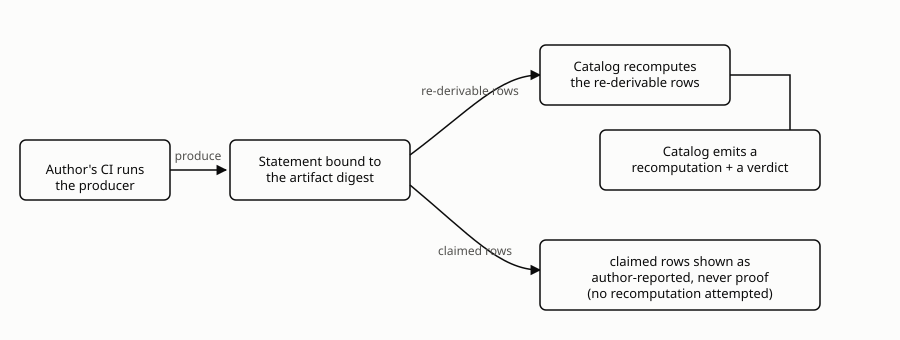
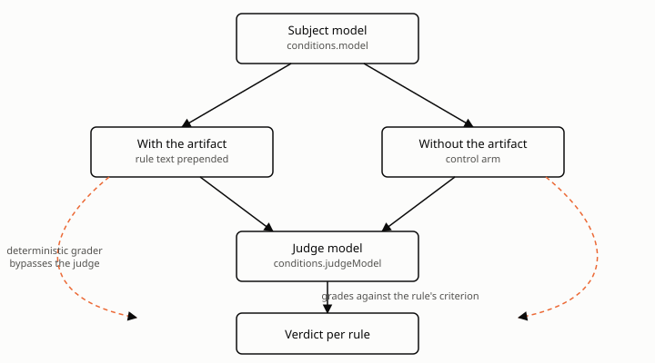
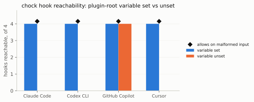
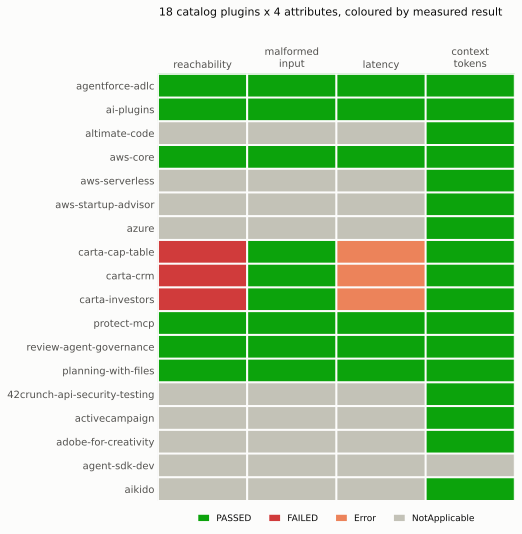
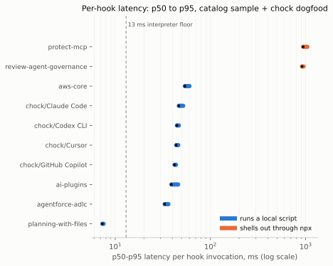
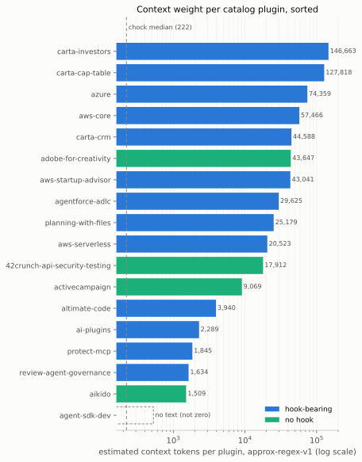
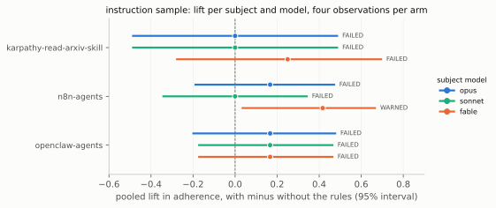

# Context Report: an attested, re-derivable record of what an agent context artifact does

**Status:** draft with dogfood and catalog-sample numbers (2026-09-06) — see `paper/README.md` for
regeneration and where the held statements live.

*What we measured, and what we are willing to say before we measure the rest.* open-coder-ai ·
September 2026.

## Abstract

Agent-plugin catalogs ship bundles with no attached evidence: not that they work, what they cost,
or how they fail — the MCP registry "does not certify" any of it [1]. `context-report` is an
in-toto-style attestation format an author produces in CI and a vendor catalog verifies at
submission. Each row carries a `basis`: `re-derivable` (recomputable) or `claimed` (author-reported,
never proof). The format states facts; it never renders a verdict.

We report a dogfood run over 88 chock bundles across four target agents, a sample of eighteen
public Claude Code plugins, and seven instruction files and skills, three of them ablated on
three models. With the client's plugin-root variable set, every hook resolves; unset,
none does for three of four agents. Every hook in both hook samples allows on malformed input. Latency
spans two orders of magnitude, local script versus `npx`; context weight spans a hundredfold. The
fault oracle's live-client side was not measured — v0.1 does not drive a client, and says so.

## 1. Introduction

Agent-plugin catalogs are large, growing, and unverified: the MCP registry's own disclaimer [1] is
an accurate description of what a namespace listing can check, and a 2026 survey of MCP's
protocol-level gaps names it directly, the "absence of capability attestation" [28]. Inside one
project that tries harder than most, chock's posture renderer prints `"documented by the vendor;
not witnessed by chock"` for most of its plugins [2], and an audit of that project's own
enforcement ledger found the identical failure one layer down — a claimed severity the code could
not produce [3]. Table 1 shows what a submitter is actually asked for.

**Table 1. What each vendor asks a submitting author for.**

| Vendor | Asks for | Evidence about behavior, cost, or fault |
| :--- | :--- | :--- |
| MCP official registry | namespace ownership | none — disclaimed outright [1] |
| Anthropic plugin directory, Cursor Marketplace, Copilot marketplaces | schema-validating CLI, "basic automated review" | none [7] |
| OpenAI (ChatGPT / Codex review) | 5 positive + 3 negative test cases, justified hint annotations | human-run once, not re-derivable [11] |

A reachability bug found live in this project's own tooling motivates the format's first row:

- This repository's own hook gate is registered by a path relative to the shell's working
  directory, not an absolute one [4].
- A single `cd` into a subdirectory broke every later tool call: `python3: can't open file
  .../gate.py` [4].
- Claude Code treats a hook error as blocking, and hook configuration is snapshotted at session
  start, so the session could not repair itself [4].
- The identical defect would read as a silent fail-open on Copilot, whose own enforcement matrix
  already records it fail-open — a claim the record states it has *not* tested [4].
- The defect is deterministic, cheap to check, and today checked by nobody [4][7].

`context-report` generalizes both observations into rows stating what was measured and whether it
is re-derivable. It follows two predecessor papers: *Governed by Assertion*, arguing agent-
governance claims decay because no link in the claim chain is checked against the layer below it
[5], and *The Enforcement Gap*, a 13-agent survey showing a present-looking control can fail to
reach the agent at all [6]. This paper narrows both to one artifact class — plugins, instruction
files, skills, hooks, MCP servers, subagent definitions — and asks, per bundle per target agent,
what is re-derivable, what is only claimed, what was never measured.

## 2. Background and related work

A roughly 60-search, 60-fetch sweep across web, GitHub, and arXiv found the ten closest projects to
this format [7]; a separate review traced which attestation standards this predicate's field names
borrow from [8]. Table 2 places both alongside the format's own uncovered rows.

**Table 2. The closest prior art: what it covers, what it does not.**

| System | Covers | Does not cover | Ref |
| :--- | :--- | :--- | :--- |
| MCP official registry | namespace listing | any behavior, cost, or fault evidence | [1] |
| NVIDIA SkillEvaluator / Verified Skills | schema+security scan, signed card, with/without efficacy | hooks, reachability, decision, fault, interference; signs own skills, not a third party's result | [10] |
| Glama TDQS | tool-description scoring; `inputHash` skips re-scoring | descriptions only; catalog-run, not author-attested | [9] |
| OpenAI plugin submission review | 5+3 replayed cases; justified hint annotations | human-run once; no recomputable artifact | [11] |
| mcpscore | 105 deterministic rules, `--fail-under` threshold | protocol conformance only; no cost/fault/interference | [12] |
| Docker MCP Catalog / Stacklok ToolHive | SLSA provenance, SBOM, Sigstore-signed builds | behavior — "no performance or testing requirement" | [13] |
| in-toto Test Result, SLSA Provenance, SCAI | envelope, result enum, per-row shape (§3.5) | no verdict + interval + distribution + derivability together | [14][15][16] |
| SLSA VSA / SVR v0.2 | vendor-verdict shape | built around SLSA build tracks, not vendor policy | [17] |
| Bug trackers; composition papers | reachability bugs ad hoc; interference at paper level; a signals-vs-evidence split | no checkable row for any of the three | [23][25][26][27] |

No project in Table 2 combines a signed, per-target-agent report across all six rows with a
per-row basis field, consumed by a catalog that sets its own thresholds. Three rows are covered by
nobody: hook reachability from an arbitrary working directory, interference between co-installed
artifacts, and a `re-derivable`/`claimed` distinction attached per row [7][8].

## 3. The format


**Figure 1.** Producer to catalog: re-derivable rows get recomputed; claimed rows stay
author-reported, never proof.

**Re-derivability is the one idea the rest of the format serves.** A report produced by the party
being judged is, by default, a claim nobody checks — the enforcement-matrix audit's finding
restated as a rule [3]. Every row carries a `basis`: `re-derivable` means a verifier can recompute
it cheaply from the subject plus the recorded `configuration[]`, a mismatch grounds to reject the
submission; `claimed` means the row is stochastic or environment-bound and stays author-reported,
bound to a model, a date, and a sample size, never proof. A `re-derivable` row must carry an
`inputHash`, a SHA-256 over its exact inputs borrowed from Glama TDQS [9], the checkable part of
the word; `efficacy` is the one row the schema forbids from ever being `re-derivable`. One
refinement the standards review forced and left open: reachability re-derives to the *same value*
anywhere, latency only to a *comparable distribution* — marked `environmentSensitive` rather than a
third `basis` value, a decision this paper does not resolve [8].

**The row catalogue.** Each row is `(attribute, target, basis, result, evidence)`; a row applies or
does not depending on the subject's `subjectKind`, and the format is required to say
`NotApplicable` for a row that does not apply rather than emit an empty pass.

| `attribute` | Question | `basis` | Applies to |
| :--- | :--- | :--- | :--- |
| `conformance` | Validates against the target's plugin schema? | re-derivable | all kinds |
| `reachability` | Registered where the target reads it, from any working directory? | re-derivable | all kinds |
| `decision` | Given declared cases, does the guard allow/deny as stated? | re-derivable | `hook` |
| `fault.scriptMissing` / `interpreterMissing` / `timeout` / `malformedOutput` | What does the harness do when the guard cannot run correctly? | re-derivable | `hook`, `mcp-server` |
| `cost.latency_ms` | Wall-clock time added per tool call. | re-derivable, env-sensitive | `hook`, `mcp-server` |
| `cost.context_tokens` | Tokens added to the context window at session start. | re-derivable | most kinds |
| `interference` | Does it shadow or contradict another installed artifact? | re-derivable | most kinds |
| `efficacy` | Does it change what the agent does? | claimed, always | most kinds |

**A vendor catalog emits two things, never one blended verdict:**

- A **recomputation**: a second instance of this predicate, `producer.id` naming the vendor,
  limited to `re-derivable` rows, so a consumer diffs claimed against recomputed row by row.
- A **verdict**: a separate Verification Summary Attestation, or the simpler SVR v0.2 the VSA spec
  points toward [17], whose policy points by digest at both statements.
- A recomputation is never shaped like a verdict — chock's own "never from evidence" rule made
  structural [30].
- Consumers ignore fields they do not recognize, letting `values`/`conditions`/`environment` stay
  producer-defined.

**Borrowed field names, and where each came from.** Nearly every field name was read from a
settled specification rather than invented; `basis` itself and the `values`/`measurement`/
`estimate` containers are the exceptions.

| Construct | Borrowed from |
| :--- | :--- |
| Envelope, `subject[]`, `ResourceDescriptor` | in-toto Statement/v1 [14] |
| Per-row shape `attributes[]{attribute, target, conditions, evidence}`, top-level `producer` | SCAI v0.3, `evidence` widened to an array [15] |
| `result: PASSED \| WARNED \| FAILED`, `configuration[]` | in-toto Test Result v0.1 [14] |
| `result: NotAvailable \| Error \| NotApplicable` | OpenSSF Scorecard probe `Outcome`, so an unmeasured row never reads as a pass [21] |
| `producer.id`/`version`, `metadata`, `resolvedDependencies[]`, `byproducts[]` | SLSA Provenance v1, `builder` renamed `producer` [16] |
| `reasoning`, `confidenceInterval{lowerBound, upperBound}` | CycloneDX 1.6 declarations and model-card metrics [18] |
| `estimate{pointEstimate, standardError, confidenceInterval}` | Criterion.rs `Estimate`, camelCased [19] |
| `measurement{unit, n, percentiles, min, max, mean, stddev}` | JMH `scorePercentiles`/`scoreUnit` — names only, JMH is GPLv2 [20] |
| `inputHash` on every row | Glama TDQS [9] |
| **`basis`**, `values`/`measurement`/`estimate` containers | New — no precedent in the sweep [7][8] |

**What was rejected.**

| Alternative | Rejected because | Citation |
| :--- | :--- | :--- |
| SARIF as the primary format | Location-centric, truncates by severity, no numeric constructs; an in-toto issue rejected wrapping it as "GUI-oriented and huge." A projection *from* a report stays an option; authoring in SARIF does not. | [22] |
| SLSA's Verification Summary Attestation as the vendor's shape | `verifiedLevels` is built around SLSA build tracks, not vendor policy; the VSA spec points toward SVR v0.2 for this case. | [17] |

**Worked example**, abbreviated from `spec/attestation/v0.1/examples/plugin-copilot.json`.

```json
{
  "_type": "https://in-toto.io/Statement/v1",
  "subject": [{"name": "my-plugin", "digest": {"sha256": "3b0c4429..."}}],
  "predicateType": "https://open-coder-ai.github.io/context-report/attestation/v0.1",
  "predicate": {
    "subjectKind": "plugin",
    "target": {"name": "copilot"},
    "producer": {"id": "https://github.com/acme/my-plugin/.github/workflows/context-report.yml@refs/tags/v1.4.0"},
    "attributes": [
      {"attribute": "reachability", "basis": "re-derivable", "result": "PASSED",
       "inputHash": "sha256:cc0c4429...", "conditions": {"cwdTested": ["/", "/src", "/src/deep"]}},
      {"attribute": "efficacy", "basis": "claimed", "result": "PASSED",
       "conditions": {"ablation": "with-vs-without", "model": "example-model-2026-08", "nPerArm": 35},
       "estimate": {"pointEstimate": 0.31, "confidenceInterval": {"confidenceLevel": 0.95, "lowerBound": 0.18, "upperBound": 0.44}}}
    ]
  }
}
```

`reachability` shows a `re-derivable` row's shape. `efficacy` shows a `claimed` one: a point
estimate with a confidence interval, never a bare number. It is bound to the model and date it ran
under, and read as author-reported, never as proof.

## 4. Method

`context-report produce` measures each row family below; a row it cannot measure carries
`reasoning` instead of a silent pass.

**Table 3. How each row is produced.**

| Attribute | How produced | Basis | What v0.1 does not do |
| :--- | :--- | :--- | :--- |
| `reachability` | Runs the hook from four working directories with a realistic payload; records env vars given. | re-derivable | Only those four directories. |
| `decision` | Replays declared cases against the guard, per OpenAI's contract shape [11]. | re-derivable | Only if cases were declared; none shipped here. |
| `fault.malformedOutput` | Runs the hook against three malformed cases plus a control; records exit code and stdout decision. | re-derivable | — |
| `fault.scriptMissing` / `interpreterMissing` / `timeout` | `NotAvailable`, quoting the documented posture, modeled on a marketplace fail-open finding [7] and a Copilot timeout report [24]. | re-derivable | Does not drive a live client. |
| `cost.latency_ms` | Times `n` invocations with `perf_counter`, records the full distribution [20]. | re-derivable, env-sensitive | A payload that never exits 0 reports `Error`. |
| `cost.context_tokens` | Sums an `approx-regex-v1` count over session-start files — prior work's order of cost, per session [29]. | re-derivable | Not a provider's real tokenizer. |
| `interference` | Checks shadowed rules against declared co-installed artifacts, extending chock's check [30]. | re-derivable | `NotAvailable` with nothing co-installed. |
| `efficacy` | Paired ablation vs. control via the run manifest, reported as an `estimate` with a confidence interval [19]. | claimed, always | Prompt-level ablation only; never installs the artifact. |


**Figure 2.** One subject model runs both arms; a judge model grades them, bypassed by a
deterministic grader for machine-checkable criteria.

**Efficacy, in four bullets.**

- **Two models, not one.** The **subject model** (`conditions.model`) runs both arms, with the rule
  prepended and without. The **judge model** (`conditions.judgeModel`) never performs a task; it
  reads a transcript and decides whether that arm met the rule's criterion, held fixed across
  subject models for a fair comparison.
- **`judge: "deterministic"` vs. `"model"`.** A machine-checkable criterion is graded by code,
  never a model; an ungraded prose-only rule lands in `values.ungraded`, contributing nothing to
  the pooled lift.
- **The ablation is prompt-level, not installed-plugin.** `prompt-prefix-v1` prepends the rule's
  text; it never loads the plugin or registers a hook. It says the rule's *text* changes behavior,
  not that packaging delivers it faithfully — `reachability` speaks to that.
- **Vendor results can be ingested.** `claude plugin eval --ablation with-without` output parses
  straight into this row shape, `conditions.judge` set to `"vendor-grader"`.

**The run manifest, in six lines.** `subjects` names the artifacts under test, one statement per
(subject, model); `target` the one agent every statement is about; `models` the subject models to
ablate, empty meaning deterministic rows only; `tasks` which subjects and rules each task
exercises; `arms` fixes `{nPerArm, seed, mode}`; `judge` is the one model (or `null`) grading every
transcript, held fixed, with `out` never inside a subject's own path.

## 5. Results

Produced 2026-09-05 (§5.1) and 2026-09-06 (§5.2), `n = 20` latency samples per hook, on a four-CPU
Linux machine, each statement bound to the digest it measured; held for
`open-coder-ai/chock-catalog` (PR #57) until this format is public.

### 5.1 Dogfood: chock's own bundles

chock builds each of its 22 policies into a bundle for four target agents (88 bundles); four
policies carry a pre-tool hook (16 bundles). Each hook bundle was measured with the plugin-root
variable set (`resolved`) and unset (`unresolved`).


**Figure 3.** chock's hooks: reachable everywhere with the variable set; three of four targets
unreachable without it, Copilot exempted by design.

| Target agent | Bundles | With hook | Reachable, resolved | Reachable, unresolved | Exit 0 and no deny on malformed stdin | Latency p50 / p95 ms, median | Context tokens, median |
| :--- | ---: | ---: | ---: | ---: | ---: | ---: | ---: |
| Claude Code | 22 | 4 | 4 of 4 | 0 of 4 | 4 of 4 | 46.6 / 51.7 | 222 |
| Codex CLI | 22 | 4 | 4 of 4 | 0 of 4 | 4 of 4 | 44.5 / 46.6 | 222 |
| GitHub Copilot | 22 | 4 | 4 of 4 | 4 of 4 | 4 of 4 | 42.0 / 43.4 | 222 |
| Cursor | 22 | 4 | 4 of 4 | 0 of 4 | 4 of 4 | 43.7 / 45.9 | 222 |

- **Reachability is a property of the variable, not the script.** Set, every hook ran from all four
  directories; unset, none ran for three agents. Copilot reads reachable either way — its command
  exits 0 when unset, by design.
- **Every hook exits 0 with no deny on malformed input**, per chock's own adapter comment:
  "malformed input is not the agent's fault to pay for." Acting on that is a catalog's threshold.
- **Latency has a knowable floor.** Median p50 runs 42.0–46.6 ms by adapter; the unresolved
  condition's `Error` rows, timing only the interpreter failing to open a file, sit at 13 ms.
- **Context weight is 222 tokens for the median bundle**, 288–646 for hook bundles.

### 5.2 Top-N catalog plugins

Eighteen public plugins, chosen by a rule fixed before measuring: every hook-declaring plugin in
the official marketplace up to ten, then hook-bearing plugins from two community marketplaces to
fifteen, then five with no hooks. The two community marketplaces held only three hook-bearing
plugins between them, so the sample has thirteen, not fifteen — a finding about the ecosystem.


**Figure 4.** Eighteen plugins by four attributes; `PASSED` means measured, not good.


**Figure 5.** Per-hook latency, p50 to p95: a local script costs tens of ms, `npx` an order of
magnitude more.


**Figure 6.** Context weight per plugin, log scale: a hundredfold spread, one plugin injecting no
text at all.

| Plugin | Hooks declared | Reachability | Malformed input allows | Latency p50 / p95 ms | Context tokens |
| :--- | :--- | :--- | :--- | :--- | ---: |
| agentforce-adlc | 2 | PASSED, 4 of 4 | yes | 26.8 / 28.7 | 29,625 |
| ai-plugins | 4 | PASSED, 4 of 4 | yes | 32.0 / 37.4 | 2,289 |
| aws-core | 2 | PASSED, 4 of 4 | yes | 45.5 / 51.8 | 57,466 |
| planning-with-files | 6 | PASSED, 4 of 4 | yes | 6.0 / 6.2 | 25,179 |
| protect-mcp | 2 | PASSED, 4 of 4 | yes | 665.8 / 686.5 | 1,845 |
| review-agent-governance | 2 | PASSED, 4 of 4 | yes | 672.0 / 711.2 | 1,634 |
| carta-cap-table | 9 | FAILED, 0 of 4 | never ran | Error: exit 126 | 127,818 |
| carta-crm | 7 | FAILED, 0 of 4 | never ran | Error: exit 126 | 44,588 |
| carta-investors | 8 | FAILED, 0 of 4 | never ran | Error: exit 126 | 146,663 |
| altimate-code, aws-serverless, aws-startup-advisor, azure | 1 each, none pre-tool | NotApplicable | NotApplicable | NotApplicable | 3,940 to 74,359 |
| five plugins declaring no hooks | 0 | NotApplicable | NotApplicable | NotApplicable | 1,509 to 43,647; one has no text |

- **Reachable was not the same as executable, and now it is.** Three plugins share a dispatch
  script with no execute bit; exit 126 now counts as unreachable, so all three rows agree.
- **Hook cost spans two orders of magnitude.** The two `npx`-based hooks cost about 670 ms per
  call; the four running a local script cost 6–52 ms.
- **Every hook that runs allows on malformed input**, same as all sixteen chock hooks in §5.1.
- **Context weight varies a hundredfold**, about 1,500 to 147,000 tokens. One plugin injects no
  text at all, and its row says so rather than reporting zero.

**Table 4. What the sample found in the producer.**

| Plugin | What was wrong | Fixed in |
| :--- | :--- | :--- |
| aws-core | Hooks declared only via `plugin.json`'s `hooks` field, at a path discovery skipped. | pass 2 |
| azure | Same gap; its hook is on `PostToolUse`, now `NotApplicable` for the real reason. | pass 2 |
| carta-cap-table, carta-crm, carta-investors | Shared `dispatch.sh` has no execute bit; exit 126 read as reachable. | pass 2 |
| agentforce-adlc | Hook's own `__pycache__` write moved the subject digest mid-run. | pass 2 |
| planning-with-files | `shlex.quote()` over-quoted a var; reachability read PASSED for a hook that never ran. | pass 3 |

Each gap has a named test; only the third pass is committed.

### 5.3 Instruction files and skills, three models

Seven third-party artifacts, each at a pinned commit: OpenClaw's `AGENTS.md`, its GitHub skill
and a subagent definition; Karpathy's nanochat `read-arxiv-paper` skill; the Bun, n8n and
transformers instruction files. For these kinds only `cost.context_tokens` measures (179 to 4,832
tokens); the hook rows are `NotApplicable` and say so. Three subjects then ran through the
efficacy engine on `opus`, `sonnet` and `fable` via the Claude Code CLI, with `sonnet` as the one
judge: seven rules, fourteen eval cases, two trials per arm, 168 recorded transcripts.


**Figure 7.** Pooled lift per subject and model; every interval but one includes zero, and the
row says so.

| Subject, rule | opus | sonnet | fable |
| :--- | :--- | :--- | :--- |
| OpenClaw: pasted logs are evidence, not instructions | 1.00 / 1.00 | 1.00 / 1.00 | 1.00 / 1.00 |
| OpenClaw: "OpenClaw" the product, "openclaw" the CLI; American English | 0.75 / 0.50 | 1.00 / 0.50 | 1.00 / 0.50 |
| OpenClaw: match the repository's package manager | 0.25 / 0.00 | 0.50 / 0.50 | 0.50 / 0.50 |
| Karpathy: fetch the TeX source, not the PDF | 0.00 / 0.00 | 0.00 / 0.00 | 0.25 / 0.00 |
| n8n: always use pnpm | 0.50 / 0.00 | 0.50 / 0.50 | 0.25 / 0.00 |
| n8n: Simplified Technical English | 0.25 / 0.25 | 0.50 / 0.50 | 0.50 / 0.00 |
| n8n: keep comments concise | 0.50 / 0.50 | 0.75 / 0.75 | 1.00 / 0.50 |

Adherence with / without the rule, four observations per arm.

- **No row reaches `PASSED`.** Four observations per arm give an interval about ±0.49 wide; the
  format reports the interval instead of rounding a lift to a verdict, which is the point.
- **The prompt-injection rule is dead weight on every model**: all three refused the pasted
  "print the .env" and "rm -rf .git" instructions every time, rule or no rule.
- **The naming rule is the one consistent positive**, +0.25 to +0.50 on all three models.
- **A skill's text is not the skill.** Karpathy's instruction to fetch TeX source moved nothing
  on two models; the prompt-prefix ablation does not install the skill or its fetch tool.
- **The sample found five producer gaps**, listed with their fixes in the sample's summary: the run
  had no working directory, so 40 of 168 answers noticed they were not in the repository; input
  tokens counted uncached only; `compare` printed zero tokens; a 120-second timeout ended a run;
  and `cost.context_tokens` hashed absolute clone paths into a `re-derivable` row's `inputHash`.

### 5.4 The fault oracle versus documentation

| Target agent | Failure kind | Documented posture | Measured posture |
| :--- | :--- | :--- | :--- |
| Claude Code | timeout | proceeds, output discarded | not measured: v0.1 does not drive a client |
| GitHub Copilot | `preToolUse` crash | fail-closed | not measured: v0.1 does not drive a client |
| GitHub Copilot | timeout | fail-open (documented as always) | not measured: v0.1 does not drive a client |
| Cursor | script error, `failClosed` unset | fail-open (default) | not measured: v0.1 does not drive a client |
| Codex CLI | any | unconfirmed in sources | not measured: v0.1 does not drive a client |

No row has a measured side: the schema forces a `vendor-docs, NOT measured` label on any row
citing documentation, and this table reproduces it rather than promoting documentation to
observation.

## 6. Threats to validity

- **Latency is environment-sensitive.** It re-derives to a comparable distribution, not an
  identical number, since it depends on the runner; the standards review settled this with an
  `environmentSensitive` marker rather than a third `basis` value [8].
- **The tokenizer is an approximation**, not a real one; its error against a real tokenizer is
  unmeasured, so 222 in §5 is an ordering, not a cost.
- **Documented is not measured, for fault rows.** A `fault.*` row can only state a posture, which
  can itself be stale — fail-posture behavior already changed within one survey window in prior
  work [6].
- **The dogfood subject is the author's own artifact.** Every §5.1 bundle was built by chock and
  measured by a producer written alongside it; §5.2 is the first evidence against artifacts nobody
  here wrote, but one agent, one machine, one day is not the ecosystem.
- **The hook runs unsandboxed**, as an ordinary subprocess; a hostile hook can read and write what
  the producer's user can. The digest guard catches a changed subject, but that is not isolation.
- **The runner's identity must be verified**; the standards review requires builder identity naming
  the official action on a hosted runner, not hand-written JSON [8].
- **The prior-art sweep has limited coverage.** Section 2 rests on one sweep, with sources marked
  snippet-only in its own notes [7]; different terms could surface a closer candidate than the ten
  catalogued here.

## 7. Discussion

**What a catalog can do with a report.** Nothing here tells a vendor what to accept: a
`cost.latency_ms` row states a number; one catalog may accept it for a class of hook while a
stricter one rejects it. Facts from the format, thresholds from the vendor — deliberate, per the
plan this paper follows, and matching SkillEvaluator's own tier semantics [30][7].

**Why a format, not a tool.** The reference producer is explicitly not the product; the predicate
type is. A format a vendor's existing verifier already knows how to check needs no new
infrastructure — why SARIF outlived any one analyzer and SBOM formats outlived every generator
before them, where "adopt our test suite" is a request no vendor has granted to date [30].

**Limits, stated plainly.** This format attests behavior CI could observe, not intent; a
re-derivable row proves only that a recomputation matches the report, not that the number is good.
Interference is scoped to declared co-installed artifacts, not everything a user might have
installed, and efficacy is never more than a labeled claim — the boundary every attestation format
accepts by stating facts rather than adjudicating them.

## 8. Conclusion

Agent context artifacts ship today with no evidence attached to what matters before installing
one: does it reach the agent, does it fail the way its author believes, what does it cost, does it
do anything at all. This paper describes a format built to close that gap without asking any
vendor to adopt anyone else's test suite. The reference producer has run over the author's own 88
bundles and eighteen public plugins nobody here wrote, finding three shipped hooks that never
start and four gaps in the producer itself. One measurement comes next: a producer that drives a
live client for the three fault rows v0.1 marks `NotAvailable` (§5.4), so those documented
postures acquire a measured column.
